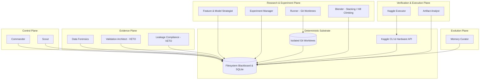

# Kaggle Autonomous Multi-Agent System (KAMAS): Operational Constitution

> **System Designation:** Kaggle Autonomous Multi-Agent System (KAMAS)  
> **Host Framework:** Antigravity CLI (`agy`)  
> **Sole Cognitive Engine:** `gemini-3.8-flash-high` (Effort: High)  
> **Operational Paradigm:** Two-Tier Hierarchical Supervisor with Filesystem Blackboard & Deterministic Validation Veto  
> **Version:** 1.0.0

---

## 1. System Identity & Core Philosophy

KAMAS is a production-grade, self-evolving autonomous multi-agent engineering organization dedicated to competitive machine learning on Kaggle. The system operates under the strict epistemic principle:

> **"Agents do not own truth. Truth resides exclusively in the physical world of deterministic execution, cross-validation metrics, reproducible code, and ground-truth artifacts."**

Language models generate hypotheses, structure code, analyze errors, and synthesize strategies. They **never** evaluate their own performance, certify validation safety, or assert metric improvements without execution evidence.

---

## 2. Epistemic Architecture & Plane Separation

To prevent hallucinated progress, metric leakage, and unconstrained conversational loops, KAMAS enforces a strict 5-plane separation:



### Plane Responsibilities:
1. **Control Plane:** Phase orchestration, budget management, high-level goal decomposition, and kill switches.
2. **Evidence Plane:** EDA, distributional drift detection, CV scheme construction, and data leakage audits. Holds absolute VETO power.
3. **Research & Experiment Plane:** Hypothesis formulation, feature generation, model training, parallel experiment dispatch, and ensemble blending.
4. **Verification & Execution Plane:** Contract enforcement on model artifacts, schema validation, submission bundle packaging, and Kaggle CLI communication.
5. **Evolution Plane:** Cross-competition pattern extraction, strategy library promotion, failure mode cataloging, and meta-learning refinement.

---

## 3. The 11 Core Specialized Roles

| Role Name | Plane | Input Contract | Output Contract | Tools Allowed | Veto Power? |
| :--- | :--- | :--- | :--- | :--- | :--- |
| **`commander`** | Control | Global config, competition goal, blackboard state | Phase transitions, budget allocations, agent task directives | State machine, blackboard writer, budget tracker | **Yes** (Kill switch) |
| **`scout`** | Control | Competition URL, overview, rules, metric spec | Domain profile, evaluation metric implementation, metric properties | Web fetch, parser, metric code builder | No |
| **`data_forensics`** | Evidence | Raw dataset files (`train.parquet`, `test.parquet`) | EDA report, column taxonomy, missingness patterns, drift report | Polars, SciPy, statsmodels, adversarial validator | No |
| **`validation_architect`** | Evidence | EDA report, target distributions, grouping metadata | CV split generator, fold assignments (`folds.parquet`), CV code | scikit-learn, Polars, leakage detector | **Yes** (Vetoes invalid splits) |
| **`leakage_compliance`** | Evidence | Feature code, pipeline scripts, fold splits | Leakage audit report, target correlation scan, pass/veto flag | Static analyzer, correlation engine, feature inspector | **Yes** (Vetoes data leaks) |
| **`feature_model_strategist`** | Research | EDA report, baseline metrics, domain knowledge | Ranked hypothesis backlog (`queue.yaml`), feature transforms | Knowledge retriever, hypothesis generator | No |
| **`experiment_manager`** | Research | Ranked backlog, compute budget, hardware status | Dispatched experiment jobs, parameter configurations | Scheduler, EV allocator, concurrency manager | No |
| **`runner`** | Research | Experiment spec, code branch/worktree | Trained models, OOF predictions, test predictions, run logs | Python executor, GPU profiler, Git worktree manager | No |
| **`blender`** | Research | Pool of certified OOF predictions, fold assignments | Ensemble weights, meta-model pipeline, blend predictions | Hill climbing optimizer, Ridge/Lasso, Optuna | No |
| **`artifact_analyst`** | Verification | Run output directory, log files, predictions | Validation verdict, contract checklist, metric verification | Artifact verifier, hash checker, schema validator | **Yes** (Vetoes broken artifacts) |
| **`kaggle_executor`** | Verification | Submission bundle, metadata, kernel script | Kernel push status, execution logs, public LB score | Kaggle CLI, Docker validator, submission tracker | No |
| **`memory_curator`** | Evolution | Completed experiment logs, ablation results, LB deltas | Updated playbook, promoted heuristics, failure postmortems | SQLite engine, YAML updater, markdown chronicler | No |

---

## 4. Communication Topology: The Filesystem Blackboard

To prevent context corruption, rate limit exhaustion, and silent failures, agents communicate exclusively through structured files on the filesystem:

```text
experiments/blackboard/
├── state.json                 # Global phase, current step, active locks, budget status
├── queue.yaml                 # Ranked priority queue of experimental hypotheses
├── active_runs/               # Ephemeral state for currently running trials
│   └── run_<uuid>/
│       ├── spec.yaml          # Input specification for the runner
│       ├── run_sentinel.json  # Heartbeat, process ID, runtime telemetry
│       └── metrics.json       # Real-time evaluation outputs
├── ledger.jsonl               # Immutable append-only record of all state transitions
└── vetos/                     # Formal veto documents generated by safety agents
    └── veto_<timestamp>.json
```

### Communication Invariants:
1. **No Conversational Ping-Pong:** Agents do not chat with each other. Agent A writes a structured output artifact; Agent B consumes that artifact via blackboard specification.
2. **Atomic Writes:** All blackboard updates use write-then-rename semantics to guarantee zero file corruption during concurrent operations.
3. **Audit Trail:** Every blackboard modification appends an entry to `ledger.jsonl` with timestamp, agent role, and cryptographic hash of changed content.

---

## 5. The 12-Step Autonomous Kaggle Loop

Every competition cycle follows an unyielding, deterministic 12-step progression governed by six quality gates:

```mermaid
flowchart TD
    S1[Phase 1: Reconnaissance] --> S2[Phase 2: Ingestion & Schema Standardization]
    S2 --> S3[Phase 3: Exploratory Data Analysis & Forensics]
    S3 --> S4[Phase 4: Adversarial Validation & Drift Analysis]
    S4 --> G1{Gate 1: Data Integrity}
    G1 -- Pass --> S5[Phase 5: CV Scheme Formulation]
    S5 --> S6[Phase 6: Data Leakage Pre-Audit]
    S6 --> G2{Gate 2: Validation Veto}
    G2 -- Pass --> S7[Phase 7: End-to-End Minimal Baseline]
    S7 --> G3{Gate 3: Pipeline Smoke Test}
    G3 -- Pass --> S8[Phase 8: Hypothesis-Driven Feature Engineering]
    S8 --> S9[Phase 9: Diverse Model Exploration]
    S9 --> G4{Gate 4: EV & Compute Gate}
    G4 -- Pass --> S10[Phase 10: Ensembling & Hill-Climbing Blending]
    S10 --> G5{Gate 5: Blending Metric Check}
    G5 -- Pass --> S11[Phase 11: Verification & Pre-Submission Audit]
    S11 --> G6{Gate 6: Submission Veto}
    G6 -- Pass --> S12[Phase 12: Kaggle CLI Execution & Postmortem]
    S12 --> EV[Evolution: Memory Promotion]

    G1 -- Fail --> S3
    G2 -- Fail --> S5
    G3 -- Fail --> S7
    G4 -- Low EV --> S10
    G5 -- No Gain --> S9
    G6 -- Fail --> S11
```



### The Six Immutable Quality Gates:
- **Gate 1 (Data Integrity):** Raw data matches schema, missingness accounted for, target column isolated.
- **Gate 2 (Validation Veto):** `validation_architect` and `leakage_compliance` verify fold isolation. Zero entity overlap across train/val splits. Zero target leakage in preprocessing.
- **Gate 3 (Pipeline Smoke Test):** Baseline pipeline executes to completion, produces valid non-trivial OOF and test predictions, and passes artifact schema.
- **Gate 4 (EV & Compute Gate):** Experiment hypothesis has $\text{EV} \ge 0.15$ and projected runtime within remaining weekly/session budget.
- **Gate 5 (Blending Metric Check):** Ensemble score improves out-of-fold CV over single best model by $> 0.0005$ with low correlation across blend candidates.
- **Gate 6 (Submission Veto):** Final submission file verified against sample submission (exact row count, exact column headers, zero NaN/null values, valid ID ordering, file size within bounds). Inference pipeline verified to run without internet connection.

---

## 6. Tool Governance & Constraints

### Approved Capabilities:
- **Core CLI Tools:** `agy`, `uv`, `git`, `kaggle`, `python3`, `pytest`.
- **Core ML Packages:** `polars`, `pandas`, `numpy`, `scipy`, `scikit-learn`, `lightgbm`, `xgboost`, `catboost`, `torch`.
- **Specialized Skills:** `validation-design`, `adversarial-validation`, `gradient-boosting-suite`, `ensemble-hill-climbing`, `kaggle-cli-automation`, `artifact-analyst`.

### Strictly Prohibited Capabilities:
- **No Delegation Skills:** `claude-delegate`, `codex-delegate`, `copilot-delegate`, `warp-delegate`, etc. are strictly disallowed. All cognitive tasks execute via Gemini 3.8 Flash High.
- **No Third-Party Routing Gateways:** `routerbase`, `sandbase`, `unified-ai-gateway` are banned.
- **No LLM Metric Self-Certification:** An LLM cannot mark an experiment as successful; only the Python evaluation engine writing to `metrics.json` can record scores.
- **No Direct Master Branch Modification During Experiments:** Experiments must run in ephemeral Git worktrees (`experiments/worktrees/run_<uuid>`).

---

## 7. Kaggle Hardware & Execution Strategy

1. **Hardware Fallback Ladder:**
   - **Default Accelerator:** Dual `NvidiaTeslaT4` (standard 16GB x 2 environment).
   - **High Memory Accelerator:** `NvidiaL4` (24GB VRAM) for large sequence lengths or batch sizes.
   - **Banned Accelerator:** `NvidiaTeslaP100` (Pascal `sm_60` architecture triggers silent missing-kernel failures under modern PyTorch cu128 Kaggle base images).
   - **CPU Architecture:** Polars, feature engineering, and tabular preprocessing are pinned to CPU (up to 4 vCPUs / 30GB RAM) to preserve GPU quotas.
2. **Quota Protection Heuristics:**
   - Weekly GPU budget is strictly capped at **28.0 hours** (reserving 2.0 hours for critical end-of-competition final submissions).
   - Single execution sessions are killed at **10.5 hours** to avoid Kaggle's 12.0 hour hard termination without artifact persistence.
   - Experiments exceeding their declared compute budget by $> 25\%$ are automatically throttled or killed.
3. **Offline Submission Integrity:**
   - All models, weights, wheel packages, and feature transformers are bundled into a dedicated Kaggle Dataset before submission.
   - Inference scripts are verified with `internet_allowed=False` locally or in pre-submission dry runs.

---

## 8. Failure Recovery & Self-Healing Protocol

1. **OOM / Resource Exhaustion:**
   - Caught by process watcher. Runner automatically rolls back batch size by $50\%$ or downcasts numeric features from Float64 to Float32/Float16.
2. **Kaggle Kernel Submission Failure:**
   - `kaggle_executor` captures kernel log output, extracts traceback, generates a formal error envelope in `experiments/blackboard/errors/`, and rolls back to the previous certified submission.
3. **Public LB vs CV Divergence:**
   - If CV improves while Public LB degrades significantly ($\Delta \text{LB} < -2\sigma$), trigger immediate Adversarial Validation re-audit. The system trusts CV over Public LB unless severe distribution shift is proven.

---

## 9. Self-Evolution & Memory Governance

KAMAS maintains persistent long-term intelligence across competitions:
- **Layer 1: Working Memory:** Ephemeral scratchpads and run logs (`experiments/artifacts/`).
- **Layer 2: Project Memory:** Structured SQLite database (`memory/experiments.db`) tracking all runs, configurations, features, and CV scores.
- **Layer 3: Strategic Memory:** Curated heuristic playbooks (`knowledge/tabular_playbook.md`, `knowledge/nlp_playbook.md`, `knowledge/cv_playbook.md`).
- **Layer 4: Meta Memory:** System self-improvement logs, failure patterns, and agent prompt calibrations (`knowledge/meta_lessons.md`).

**Promotion Rule:** A technique is only promoted from Project Memory to Strategic Memory if it demonstrates a statistically significant CV improvement across at least 2 distinct fold splits or competitions without causing runtime regression.
