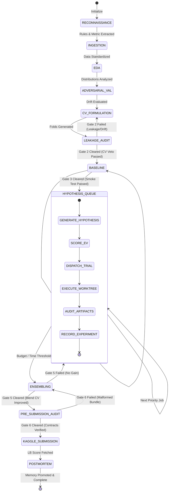
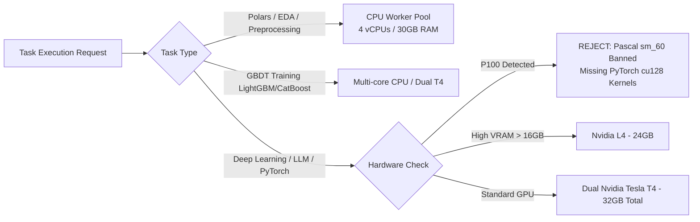

# Kaggle Autonomous Multi-Agent System (KAMAS): Architectural Specification

> **Status:** Production Standard  
> **Target Framework:** Antigravity CLI (`agy`)  
> **Cognitive Backend:** `gemini-3.8-flash-high`  
> **Hardware Environment:** Linux x86_64, Dual Nvidia Tesla T4 / Nvidia L4 / 4-core CPU  
> **Document Version:** 1.0.0

---

## 1. Executive Summary & Design Tenets

KAMAS is engineered to achieve Kaggle Master / Grandmaster level competitive performance without human intervention while adhering strictly to competition rules, compute quotas, and epistemic rigor. The architecture addresses the core pathology of current LLM multi-agent systems: **unanchored hallucinations, metric drift, conversational circularity, and data leakage.**

### Core Tenets:
1. **Epistemic Subordination:** The language model propose hypotheses; physical code execution and statistical tests dispose them.
2. **Asynchronous Decoupled Blackboard:** Agents interact via filesystem artifacts (JSON, YAML, Parquet, SQLite), eliminating fragile streaming pipes and context window pollution.
3. **Deterministic Safety Gating:** Independent verification agents possess absolute veto authority. A model cannot be submitted without automated audit clearance.
4. **Hardware Awareness:** Compute budgets and hardware constraints (memory, GPU quotas, missing PyTorch CUDA kernels on older architectures) are first-class architectural constraints.
5. **Continuous Longitudinal Evolution:** Empirical lessons, successful feature templates, and failure postmortems persist into a structured, cross-competition knowledge bank.

---

## 2. High-Level Architecture & Plane Taxonomy

KAMAS partitions responsibilities into five operational planes anchored to a deterministic execution substrate:

```mermaid
graph TB
    subgraph Control_Plane ["1. Control Plane"]
        Commander["Commander (Supervisor)"]
        Scout["Scout (Reconnaissance)"]
    end

    subgraph Evidence_Plane ["2. Evidence Plane (Validation & Leakage)"]
        Forensics["Data Forensics Specialist"]
        ValArch["Validation Architect (CV Veto)"]
        LeakComp["Leakage Compliance (Leak Veto)"]
    end

    subgraph Research_Plane ["3. Research & Experiment Plane"]
        Strategist["Feature & Model Strategist"]
        ExpManager["Experiment Manager (Scheduler)"]
        Runner["Runner (Git Worktrees)"]
        Blender["Blender (Hill-Climbing / Stacking)"]
    end

    subgraph Verification_Plane ["4. Verification & Execution Plane"]
        ArtifactAnalyst["Artifact Analyst (Schema Veto)"]
        KaggleExecutor["Kaggle Executor (Kaggle CLI)"]
    end

    subgraph Evolution_Plane ["5. Evolution Plane"]
        MemoryCurator["Memory Curator (Chronicler)"]
    end

    subgraph Substrate ["Deterministic Ground Truth Substrate"]
        FS_BB[("Filesystem Blackboard<br/>state.json | queue.yaml")]
        SQLite_DB[("Project Memory<br/>experiments.db")]
        Knowledge_Store[("Strategic Memory<br/>playbooks/*.md")]
        Worktree_Pool[("Ephemeral Worktrees<br/>experiments/worktrees/*")]
        Kaggle_API[("Kaggle CLI & Cloud API")]
    end

    Commander -->|Read/Write State| FS_BB
    Scout -->|Write Metric Spec| FS_BB
    Forensics -->|Write EDA & Drift| FS_BB
    ValArch -->|Write Folds & Veto| FS_BB
    LeakComp -->|Audit Code & Veto| FS_BB
    Strategist -->|Push Hypotheses| FS_BB
    ExpManager -->|Pop & Schedule| FS_BB
    ExpManager -->|Dispatch Job| Runner
    Runner -->|Execute in Sandbox| Worktree_Pool
    Runner -->|Write Metrics & OOF| FS_BB
    Runner -->|Persist Trial Record| SQLite_DB
    Blender -->|Read Certified OOFs| FS_BB
    Blender -->|Write Blend Spec| FS_BB
    ArtifactAnalyst -->|Verify Artifact Contracts| FS_BB
    KaggleExecutor -->|Submit Verified Bundles| Kaggle_API
    KaggleExecutor -->|Fetch LB Feedback| FS_BB
    MemoryCurator -->|Mine Patterns & Postmortems| SQLite_DB
    MemoryCurator -->|Promote Rules| Knowledge_Store
```



---

## 3. Finite State Machine (FSM) Specification

The lifecycle of a competition execution is represented by a strict deterministic state machine managed by the `commander`:



### State Definitions & Transitions

| State | Responsible Role | Inputs | Outputs | Gate Check |
| :--- | :--- | :--- | :--- | :--- |
| `RECONNAISSANCE` | `scout` | Competition URL / ID | `metric_spec.json`, `rules.md` | Non-empty metric implementation |
| `INGESTION` | `data_forensics` | Raw CSV / Parquet | `metadata.json`, Parquet splits | Zero row loss from raw files |
| `EDA` | `data_forensics` | Cleaned data | `eda_report.json`, summary stats | Missing values & types profiled |
| `ADVERSARIAL_VAL` | `data_forensics` | Train & Test sets | `adversarial_report.json` | Train/Test classifier AUC assessed |
| `CV_FORMULATION` | `validation_architect` | EDA report, grouping targets | `folds.parquet`, `cv_config.yaml` | Leakage-free fold distribution |
| `LEAKAGE_AUDIT` | `leakage_compliance` | Pipeline code, folds | `leakage_audit.json` | **Gate 2 Veto:** Correlation $< 0.999$, zero ID leakage |
| `BASELINE` | `runner` | Starter template, folds | `oof_preds.parquet`, `baseline_metrics.json` | **Gate 3 Veto:** End-to-end pipeline produces valid scores |
| `HYPOTHESIS_QUEUE` | `feature_model_strategist`, `experiment_manager`, `runner` | Backlog, SQLite memory | Evaluated experiment trials | **Gate 4 Veto:** EV $\ge 0.15$, compute budget positive |
| `ENSEMBLING` | `blender` | Top OOF predictions | `blend_weights.json`, ensemble metrics | **Gate 5 Veto:** $\Delta \text{CV} > +0.0005$ over best single model |
| `PRE_SUBMISSION_AUDIT` | `artifact_analyst` | Final submission candidate | `audit_cert.json` | **Gate 6 Veto:** Exact match to sample submission schema |
| `KAGGLE_SUBMISSION` | `kaggle_executor` | Certified submission bundle | `submission_log.json`, Public LB score | Verification via Kaggle CLI |
| `POSTMORTEM` | `memory_curator` | All experiment traces & LB deltas | Promoted rules in `knowledge/` | Strategic memory update confirmed |

---

## 4. Expected Value (EV) Hypothesis Scheduler

Rather than random hyperparameter sweeps or brute-force feature generation, trials in `HYPOTHESIS_QUEUE` are prioritized using the rigorous EV formula:

$$\text{Priority Score} = \frac{\mathbb{E}[\Delta \text{Metric}] \times \text{Confidence} \times \text{Information Gain}}{\text{Compute Cost} \times (1 + \text{Implementation Risk})}$$

Where:
- $\mathbb{E}[\Delta \text{Metric}] \in [0.0001, 0.05]$: Estimated improvement based on similar tasks in Strategic Memory.
- $\text{Confidence} \in [0.1, 1.0]$: Heuristic strength backed by literature or historical competition logs.
- $\text{Information Gain} \in [0.1, 1.0]$: Novelty of the idea (penalizing repetitive minor parameter tweaks).
- $\text{Compute Cost} \in [0.1, 5.0]$: Normalized expected execution hours ($1.0 \approx 30$ minutes).
- $\text{Implementation Risk} \in [0.0, 1.0]$: Probability of pipeline bug, OOM, or memory leakage.

---

## 5. Sandboxed Execution: Ephemeral Git Worktrees

To ensure total code isolation and allow concurrent or branched experimentation without polluting the working directory:
1. Every experiment dispatched by `experiment_manager` creates an isolated Git worktree under `experiments/worktrees/run_<uuid>`.
2. The experiment code runs inside the worktree against its own isolated config copy.
3. Upon completion, metrics and out-of-fold predictions are written to `experiments/artifacts/run_<uuid>/`.
4. If an experiment crashes, the worktree is inspected for tracebacks, logged to `experiments.db`, and cleanly pruned using `git worktree remove --force`.
5. Only code changes that yield a verified metric improvement are merged back to the active research branch.

---

## 6. Hardware Abstraction & Quota Shield



### Resource Quota Enforcement
- **Weekly Tracking:** Tracked persistently in `experiments/blackboard/budget.json`. If cumulative weekly GPU runtime exceeds **28.0 hours**, all future GPU jobs are halted; only CPU-based blending and postprocessing are allowed.
- **Session Timeout Watchdog:** A process sentinel monitors elapsed time. If a training run reaches **10.5 hours**, the process is sent `SIGTERM`, checkpoints and existing fold predictions are flushed to disk, and the job terminates gracefully before Kaggle's 12-hour hard termination.

---

## 7. Multi-Tier Memory Subsystem

```text
┌─────────────────────────────────────────────────────────────┐
│ Layer 1: Working Memory (Ephemeral)                         │
│ - experiments/blackboard/active_runs/                       │
│ - Process logs, intermediate checkpoints, stdio buffers     │
└──────────────────────────────┬──────────────────────────────┘
                               │ Promoted upon run completion
                               ▼
┌─────────────────────────────────────────────────────────────┐
│ Layer 2: Project Memory (Structured Relational)              │
│ - memory/experiments.db (SQLite with full schema)           │
│ - Tables: experiments, folds, features, submissions, errors │
└──────────────────────────────┬──────────────────────────────┘
                               │ Promoted upon competition conclusion
                               ▼
┌─────────────────────────────────────────────────────────────┐
│ Layer 3: Strategic Memory (Curated Domain Playbooks)         │
│ - knowledge/tabular_playbook.md                             │
│ - knowledge/nlp_playbook.md                                 │
│ - knowledge/cv_playbook.md                                  │
│ - Reusable feature templates, model recipes, blend patterns │
└──────────────────────────────┬──────────────────────────────┘
                               │ System-wide meta-synthesis
                               ▼
┌─────────────────────────────────────────────────────────────┐
│ Layer 4: Meta Memory (System Self-Improvement)              │
│ - knowledge/meta_lessons.md                                 │
│ - Agent prompt calibration, error frequency distributions,  │
│   scheduler efficiency metrics                              │
└─────────────────────────────────────────────────────────────┘
```

This ensures complete longitudinal learning: the system gets smarter with every competition it tackles.
