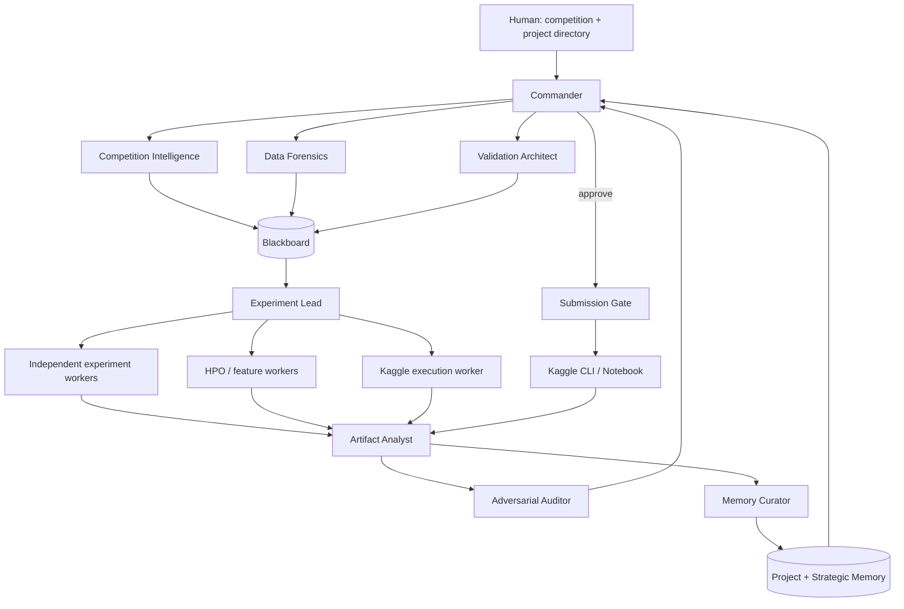
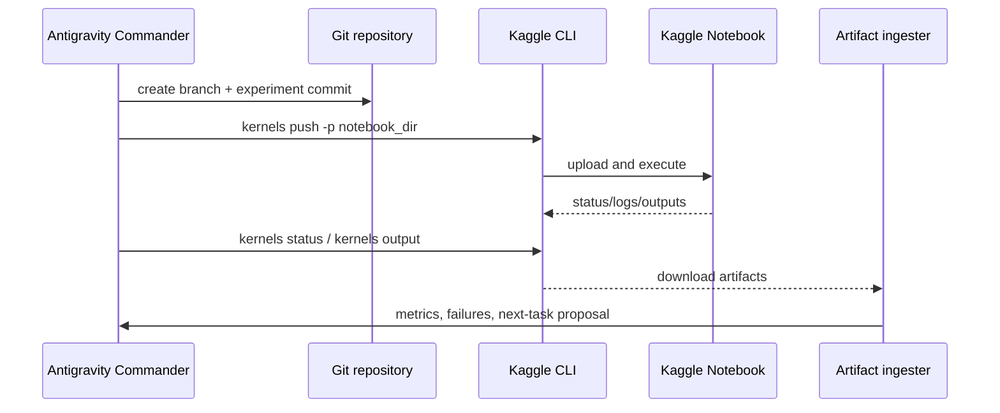
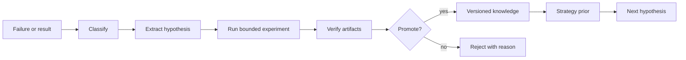

# Kaggle Agent OS — Complete Architecture Blueprint

**Status:** Recommended target architecture  
**Source of truth:** `paste.txt` and the supplied 2,121-skill catalog  
**Research date:** September 13, 2026  
**Primary runtime constraint:** Antigravity CLI (`agy`) with `gemini-3.8-flash-high` as the sole reasoning model  
**Optimization target:** Maximize expected private-leaderboard performance per unit of human effort and Kaggle compute

> This blueprint is an implementation specification, not a guarantee of ranking. It deliberately treats first place as an optimization target whose probability can be improved, not as an outcome that can be promised.

---

## 1. Executive decision

Build a **hierarchical, planner–executor–verifier system with a durable blackboard**, not a free-form swarm.

The smallest effective production roster is:

1. **Commander** — owns strategy, budgets, phase transitions, and final decisions.
2. **Competition Intelligence** — rules, metric, submission mechanics, deadlines, prior art.
3. **Data Forensics** — schema, data quality, leakage, shift, identifiers, modality.
4. **Validation Architect** — designs and can veto invalid validation.
5. **Experiment Lead** — converts hypotheses into reproducible trials and schedules them.
6. **Model/Feature Specialist** — proposes and implements modality-appropriate candidates.
7. **Artifact Analyst** — validates outputs, compares experiments, performs error analysis.
8. **Adversarial Auditor** — attacks leakage, rule compliance, reproducibility, and private-LB robustness.
9. **Memory Curator** — promotes only evidenced findings into project and strategic memory.

The Commander may spawn **short-lived task agents** for independent work, but the framework should keep the active working set small. Parallelism is used for independent experiments and audits, not for every decision.

### Why this architecture

- Antigravity CLI supports headless, machine-readable execution, model/effort/agent selection, skills, hooks, MCP, and concurrent background subagents. citeturn0search0turn0search3turn0search5turn0search11
- Kaggle’s final ranking is based on a hidden private leaderboard, so the system must optimize robust validation and not merely maximize public-LB feedback. citeturn1search2turn1search7turn1search9
- Kaggle compute and submission behavior are competition-dependent and volatile; capability discovery must therefore be runtime-configured rather than hard-coded. Kaggle documents notebook time, RAM, disk, accelerators, and competition-specific restrictions. citeturn1search0turn0search2
- Winning writeups repeatedly show that domain-specific data understanding, validation, diverse ensembles, post-processing, and resource-aware execution matter more than indiscriminate agent count. Examples include CatBoost plus metadata features, wide model ensembles, Hill Climbing/Ridge blending, and modality-specific inference tricks. citeturn3search0turn3search1turn3search6turn3search11

---

## 2. Evidence and confidence policy

Every recommendation in the system is tagged:

| Level | Meaning | Allowed action |
|---|---|---|
| `observed_fact` | Directly measured in the current competition or verified in authoritative documentation | May drive execution |
| `strong_empirical_pattern` | Repeated across credible Kaggle writeups or controlled experiments | May become a prior; must be tested |
| `engineering_practice` | Reproducibility, isolation, schemas, tests, versioning | Default unless contraindicated |
| `weak_hypothesis` | Plausible but limited evidence | Schedule only with capped budget |
| `speculation` | Unverified idea | Never auto-promote; sandbox only |

Memory promotion requires provenance, experiment identifiers, counterexamples, confidence, and a last-validated date.

---

## 3. Target operating model



### Control plane versus data plane

- **Control plane:** Antigravity agents, prompts, routing, policies, memory retrieval, budgets, approvals.
- **Data plane:** Python scripts, notebooks, model training, CV, feature generation, artifact files, Kaggle runs.
- The language model decides *what to test and why*; deterministic Python code computes scores, folds, predictions, resource measurements, and integrity checks.

This separation is essential: model-generated prose is not accepted as evidence when a deterministic artifact can verify the claim.

---

## 4. Agent roster and exact contracts

### 4.1 Commander

**Inputs:** competition brief, validated findings, budget, deadline, current best artifact.  
**Outputs:** phase plan, prioritized task queue, stop/continue decision, submission recommendation.  
**Cannot:** bypass compliance, override a validation veto without an explicit human approval, promote unverified knowledge.

### 4.2 Competition Intelligence

Produces `reports/competition_intelligence.md` and `reports/rules.json` containing metric direction, submission format, data policy, external-data policy, internet policy, notebook requirement, submission limits, deadline, and current platform capabilities.

Official Kaggle documentation states that external data is competition-specific, some competitions require notebook submissions, and compute limits are visible in the editor. citeturn0search2turn1search7

### 4.3 Data Forensics

Produces deterministic reports for schema, missingness, duplicates, cardinality, train/test differences, identifiers, target distribution, temporal/group structure, and suspicious columns. It calls specialized detectors based on detected modality.

### 4.4 Validation Architect

Has a **hard veto** over serious modeling until `validation/validation_config.yaml` exists and passes tests. It chooses among:

- stratified/grouped folds;
- time-series or purged time-series folds;
- nested or repeated validation when instability warrants it;
- competition-specific splits when the host describes test-generation logic.

Ordinary K-fold assumptions are invalid for grouped or temporal data; scikit-learn explicitly warns that IID splitters can produce unreasonable estimates on time series and documents GroupKFold/TimeSeriesSplit patterns. citeturn2search1turn2search5turn2search6

### 4.5 Experiment Lead

Maintains the registry, converts plans into immutable experiment specifications, isolates workspaces, starts deterministic jobs, and reports budget consumption.

### 4.6 Model/Feature Specialist

Uses a modality router:

| Modality | Default candidate families |
|---|---|
| Tabular | CatBoost, LightGBM, XGBoost, HistGradientBoosting, linear baseline, ExtraTrees; neural tabular only when justified |
| Time series | naive/statistical baseline, lag/rolling features, boosting, purged/group time split, temporal neural model if useful |
| Text/NLP | TF-IDF + linear baseline, token/character features, embeddings, pretrained transformer or LLM inference where rules permit |
| Vision | pretrained CNN/ViT, augmentation, TTA, image-quality and duplicate analysis |
| Multimodal | modality-specific baselines, late fusion, then intermediate fusion |
| Audio/other | modality-specific baseline plus signal-quality and augmentation analysis |

The specialist must explain why each expensive family is worth its cost.

### 4.7 Artifact Analyst

Validates schemas, checks prediction alignment and row counts, computes metrics from OOF predictions, measures model correlation and error overlap, and generates error-analysis reports.

### 4.8 Adversarial Auditor

Can block submission for leakage, rule risk, invalid preprocessing, unavailable inference features, unstable CV, malformed submission, untracked artifacts, or unexplained public-LB chasing.

### 4.9 Memory Curator

Extracts compact evidence records from experiments and rejects duplicated, contradictory, stale, or unsupported claims.

---

## 5. Blackboard and communication protocol

Agents communicate through files and structured JSON/YAML, not conversational history.

### Task envelope

```yaml
task_id: exp-2026-00017
parent_task_id: phase-model-search
agent_role: model_feature_specialist
objective: "Test CatBoost with native categoricals and target-safe fold handling"
competition_id: example
budget:
  wall_minutes: 45
  cpu_hours: 3
  gpu_hours: 0
  max_trials: 8
required_inputs:
  - data/signatures/train.parquet
  - validation/validation_config.yaml
  - reports/data_quality.json
expected_outputs:
  - artifacts/exp-2026-00017/metrics.json
  - artifacts/exp-2026-00017/oof_predictions.parquet
  - artifacts/exp-2026-00017/submission.csv
stop_conditions:
  - validation_failure
  - budget_exceeded
  - artifact_contract_failure
```

### Result envelope

```yaml
status: success|failed|blocked|inconclusive
confidence: 0.0
findings:
  - statement: "Feature view B improved mean CV by 0.0041"
    evidence_refs: [artifacts/exp-2026-00017/metrics.json]
    evidence_level: observed_fact
actions:
  - "Run the same feature view with LightGBM for diversity"
artifacts: []
risks: []
next_tasks: []
```

### Blackboard rules

1. One writer per mutable artifact; all other agents create proposals.
2. Experiment directories are immutable after completion except for an append-only audit log.
3. Promoted knowledge references artifacts by content hash.
4. Contradictions remain visible; the curator does not silently overwrite them.
5. Natural-language claims without evidence references are non-actionable.

---

## 6. Memory architecture

```text
memory/
├── working/                 # current run state; disposable
├── project/                 # competition-specific facts and experiments
├── strategic/               # cross-competition validated patterns
├── meta/                    # agent, prompt, skill, and scheduler performance
├── indexes/                 # lexical + structured indexes
├── schemas/                 # record schemas and migrations
└── promotions/              # promotion/rejection decisions
```

### Record types

- `competition_record`
- `dataset_signature`
- `validation_record`
- `experiment_record`
- `failure_record`
- `strategy_record`
- `skill_record`
- `agent_performance_record`
- `capability_snapshot`

### Retrieval

Retrieve by structured filters first: modality, metric, sample size, categorical ratio, time/group structure, competition family, compute budget, and evidence level. Use semantic retrieval only after filtering. Return a compact evidence bundle, not a transcript dump.

### Promotion rule

```text
candidate observation
→ artifact integrity check
→ reproducibility check
→ independent or repeated support where affordable
→ counterexample search
→ curator review
→ strategic promotion with confidence and expiry
```

No vector database is required for the first implementation. SQLite/JSONL plus content hashes is simpler, portable, and sufficient for a single engineer; add an embedding index only when retrieval quality is demonstrated to be limiting.

---

## 7. Validation system

Validation is the system’s most important scientific control.

### Required validation artifacts

```text
validation/
├── strategy.md
├── validation_config.yaml
├── folds/folds.parquet
├── leakage_tests/
├── stability.json
└── lb_alignment.md
```

### Required checks

- target and feature availability at inference;
- preprocessing fitted inside each fold;
- duplicate/group separation;
- time ordering and embargo/gap where required;
- train/test distribution comparison;
- metric implementation cross-check;
- score variance across folds/seeds;
- sensitivity to alternate plausible split schemes;
- test of whether public-LB evidence contradicts internal evidence.

Scikit-learn’s leakage guidance specifically recommends fitting transformations only on training subsets and using pipelines so transformations are evaluated correctly inside cross-validation. citeturn2search6

### Score ledger

Keep distinct:

```text
local CV → OOF diagnostics → public LB → private LB
```

Never replace CV with public-LB optimization. Public-LB scores are treated as noisy observations with a configurable reliability weight.

---

## 8. Experiment scheduler

The scheduler is a **budgeted evidence allocator**, not a random task queue.

```yaml
priority =
  (expected_gain * confidence * information_gain * reversibility)
  / (compute_cost * risk * coordination_cost)
```

### Scheduling policy

1. Establish a fast baseline.
2. Reserve 20–30% of budget for validation, leakage, and error analysis.
3. Run cheap, high-information interventions first.
4. Promote only candidates that beat a defined practical threshold.
5. Use Optuna or equivalent for HPO only after model family and validation are credible.
6. Reuse all trial models and OOF predictions as ensemble candidates.
7. Stop when expected improvement falls below threshold or deadline risk rises.

Optuna supports define-by-run spaces, modern samplers, pruning, visualization, and parallel studies; its documentation also notes reproducibility considerations for parallel optimization. citeturn4search0turn4search5turn4search6turn4search14

### Practical phase budgets

| Phase | Default share | Exit condition |
|---|---:|---|
| Forensics + validation | 10% | valid split and leakage report |
| Baselines | 10% | reproducible score and artifact contract |
| High-information features/models | 35% | best family and major signal sources identified |
| HPO | 20% | diminishing returns or budget cap |
| Ensemble/post-processing | 15% | robust blend beats champion |
| Audit + final rerun | 10% | submission gate passes |

---

## 9. Model and ensemble engine

The ensemble engine stores every valid OOF/test prediction pair in a model library.

```text
ensemble/
├── candidates/
├── oof/
├── test_predictions/
├── correlations/
├── weights/
├── hillclimb/
├── stack/
└── final/
```

### Selection criteria

- OOF score;
- fold/seed stability;
- prediction correlation;
- error overlap;
- calibration and metric compatibility;
- runtime and memory;
- rule compliance;
- sensitivity to plausible validation variants.

Prefer diversity-adjusted utility over raw CV rank. Automated ensemble research supports reusing intermediate models and selecting complementary models rather than discarding all but the single best trial. citeturn2search16

Kaggle writeups provide current examples of wide ensembles, hill climbing, Ridge blending, and post-processing improvements, but these are competition-specific evidence, not universal guarantees. citeturn3search6turn3search8turn3search11

### Public-LB policy

Public-LB information may influence a final selection only when:

- the submission is within the competition rules;
- the internal model evidence is already credible;
- the public signal is recorded with uncertainty;
- the decision does not depend on repeated probing;
- a robust fallback remains available.

---

## 10. Kaggle automation architecture



The official Kaggle CLI documentation supports kernel initialization, push/update, status, logs, outputs, and accelerator selection. citeturn1search1turn1search10

Verified command shapes:

```bash
kaggle kernels init -p kaggle_kernel
kaggle kernels push -p kaggle_kernel
kaggle kernels status OWNER/SLUG
kaggle kernels output OWNER/SLUG -p artifacts/kaggle_run --force
```

The scheduler must discover current accelerator availability and competition-specific limits at runtime. Kaggle’s notebook documentation lists example CPU/GPU resources and time/disk limits, but those values should be treated as volatile capabilities rather than constants. citeturn1search0

### Kaggle execution modes

- Local execution for fast iteration and debugging.
- Kaggle Notebook execution for rule-constrained or accelerator-dependent runs.
- Final clean “Save & Run All” equivalent for reproducibility when required by the competition.

Kaggle documents that notebook submissions may require a clean top-to-bottom run and that selected competitions disable internet or restrict external data. citeturn1search0turn0search2

---

## 11. Antigravity-native integration

### Verified CLI patterns

Antigravity headless mode supports one-shot prompts, JSON/streaming output, model selection, effort selection, agent selection, and explicit permission policy. citeturn0search0

```bash
agy models
agy agents
agy -p "<task>" \
  --model gemini-3.8-flash-high \
  --effort high \
  --output-format json
```

Use `--mode=plan` for architecture and unfamiliar-codebase analysis, then `accept-edits` only for trusted implementation phases. Antigravity documents `default`, `accept-edits`, and `plan` modes and separates edit approval from shell-command permissions. citeturn0search6

Use scoped permissions, not `--dangerously-skip-permissions`, in normal operation. The latter is reserved for isolated, fully trusted automation. citeturn0search0

### Skills

- Global skills: competition-agnostic reusable capabilities.
- Project skills: competition-specific rules, domain context, and local playbooks.
- Hooks: preflight validation, post-run artifact checks, and promotion gates.
- MCP: only narrowly scoped tools for structured context or safe actions; do not build a network of unnecessary servers. Antigravity documents MCP as a bridge to local tools, databases, parsers, and APIs with permissions and authentication controls. citeturn0search5

### Recommended Antigravity skill pattern

Each skill should contain:

```text
SKILL.md
schemas/
examples/
tests/
CHANGELOG.md
```

Front matter:

```yaml
name: validation-design
version: 0.1.0
purpose: Design and test competition-appropriate validation
triggers: [validation, folds, leakage, temporal, group]
dependencies: [python, sklearn]
evidence_level: engineering_practice
side_effects: none
```

---

## 12. Skill selection from the supplied catalog

The catalog contains 2,121 skills. The correct approach is **curated installation**, not bulk installation.

### Install globally or embed in core

These catalog names were present in the supplied file and are directly relevant:

```text
multi-agent-task-orchestrator
agent-memory
agent-memory-mcp
agent-orchestration-improve-agent
agent-orchestration-multi-agent-optimize
agent-orchestrator
multi-agent-architect
multi-agent-patterns
parallel-agents
dispatching-parallel-agents
context-engineering
context-optimization
context-compression
context-guardian
context-agent
agent-evaluation
agent-evaluation-reporting
data-scientist
ml-engineer
machine-learning-ops-ml-pipeline
polars
using-git-worktrees
uv-package-manager
uv
python-testing-patterns
e2e-testing
skill-creator
skill-improver
skill-installer
skill-router
skill-scanner
skill-security-audit
agents-md
agent-harness-fault-injection
error-debugging-multi-agent-review
context-window-management
hierarchical-agent-memory
memory-systems
antigravity-skill-orchestrator
recursive-context-pruning-token-budgeting
ab-testing
```

### Install per project or convert to local skills

```text
competition-rules
dataset-specific-analysis
domain-knowledge
competition-specific-playbook
native-data-fetching
data-quality-frameworks
data-engineering-data-pipeline
data-engineering-data-driven-feature
deployment-validation-config-validate
github-actions-advanced
gitops-workflow
```

The last group represents conceptual names in the catalog or capabilities that should be wrapped with project-specific rules. Verify each skill’s actual implementation before installation.

### Use only as inspiration or reject

Reject or quarantine skills that:

- call other reasoning models, OpenRouter, or external LLMs;
- install arbitrary packages or skills without review;
- schedule unbounded autonomous loops;
- delegate to unrelated CLIs when the single-model constraint forbids it;
- require cloud services, Kubernetes, or databases without demonstrated need;
- have critical risk and no tests, provenance, or rollback.

Examples in the catalog that require quarantine under this design include external-model delegation skills, arbitrary autonomous scheduling, and benchmark skills that depend on OpenRouter or other models. A skill is not accepted merely because its name sounds relevant.

---

## 13. Self-evolution

### Knowledge evolution



### Skill evolution

```text
repeated failure
→ root-cause cluster
→ generalizable missing capability
→ skill candidate
→ draft + tests
→ sandbox benchmark
→ adversarial review
→ A/B against baseline
→ promote or reject
```

### Agent evolution

Track task success, useful discoveries, false positives, wasted compute, runtime, recovery rate, reproducibility, and downstream score impact. Update routing weights only through an evaluation job with a rollback record.

No agent may modify the core router, policies, or permission rules directly.

---

## 14. Artifact contract

Every run must produce:

```text
artifacts/<experiment_id>/
├── experiment.json
├── metrics.json
├── resource_usage.json
├── predictions.parquet
├── oof_predictions.parquet
├── submission.csv
├── model_manifest.json
├── environment.lock
├── logs/
└── reports/
```

### Minimum JSON fields

```json
{
  "experiment_id": "exp-2026-00017",
  "competition_id": "example",
  "code_commit": "sha256-or-git-sha",
  "data_signature": "sha256",
  "feature_signature": "sha256",
  "validation_signature": "sha256",
  "seed": 42,
  "metric": {"name": "roc_auc", "direction": "maximize", "cv_mean": 0.0, "cv_std": 0.0},
  "runtime_seconds": 0,
  "peak_ram_mb": 0,
  "gpu_used": false,
  "status": "success",
  "conclusion": "",
  "evidence_level": "observed_fact"
}
```

The ingester rejects missing files, malformed CSVs, row-count mismatches, duplicate IDs, NaN/inf predictions, metric inconsistencies, and untracked code/data signatures.

---

## 15. Compute optimization

### Local and Kaggle

- Inspect CPU/RAM/GPU/storage before the run.
- Prefer Polars/Arrow/Parquet for large tabular processing where profiling shows a benefit.
- Cache deterministic feature views by content hash.
- Keep thread counts explicit.
- Avoid repeated CSV parsing and pandas copies.
- Measure wall time, CPU utilization, peak RAM, disk I/O, and accelerator utilization.
- Use GPU only when the model and preprocessing benefit; Kaggle notes that GPU acceleration is not useful for many conventional pandas/scikit-learn workflows. citeturn0search1
- Use `uv` or a lockfile-based environment for reproducibility, but do not make package-manager speed a substitute for experiment design.

### Budget enforcement

Each task is launched under a deadline and process group. On timeout, the runner captures logs and resource metadata, terminates descendants, and emits a classified failure. Re-running the identical failed task is forbidden unless the recovery policy changes the hypothesis or environment.

---

## 16. Failure recovery

```yaml
DATA_FAILURE: data_forensics
DEPENDENCY_FAILURE: environment_repair
CODE_FAILURE: implementer_then_test
MEMORY_FAILURE: performance_engineer
TIMEOUT: budget_manager
KAGGLE_FAILURE: kaggle_executor
VALIDATION_FAILURE: validation_architect
MODEL_FAILURE: model_feature_specialist
AGENT_FAILURE: commander_with_fallback_prompt
ORCHESTRATION_FAILURE: runtime_supervisor
ARTIFACT_FAILURE: artifact_analyst
```

Recovery policy:

1. classify;
2. preserve the failing artifact and logs;
3. determine whether the failure is local or systemic;
4. alter one relevant variable;
5. retry with a cap;
6. escalate to the Commander;
7. record the failure for future routing.

---

## 17. Security and compliance

The compliance gate verifies:

- competition rules and external-data permissions;
- internet and API restrictions;
- pretrained-model and license constraints;
- team/submission limits;
- credential presence without exposing secrets;
- notebook reproducibility;
- absence of prohibited data contamination;
- exact submission columns and row order.

Kaggle explicitly warns that external data is allowed only when the specific competition permits it, and some code competitions require submissions from inside a Kaggle Notebook. citeturn0search2

Credentials are referenced through environment/configuration, never committed. The default Antigravity permission policy should allow workspace reads/writes and only explicitly approved commands. citeturn0search0turn0search6

---

## 18. Repository structure

```text
kaggle-agent-core/
├── AGENTS.md
├── pyproject.toml
├── uv.lock
├── README.md
├── agents/
│   ├── commander.md
│   ├── competition_intelligence.md
│   ├── data_forensics.md
│   ├── validation_architect.md
│   ├── experiment_lead.md
│   ├── model_feature_specialist.md
│   ├── artifact_analyst.md
│   ├── adversarial_auditor.md
│   └── memory_curator.md
├── skills/
│   ├── kaggle-intelligence/
│   ├── data-forensics/
│   ├── validation-design/
│   ├── experiment-management/
│   ├── modality-routing/
│   ├── ensemble-optimization/
│   ├── artifact-analysis/
│   ├── compliance-audit/
│   └── knowledge-promotion/
├── hooks/
│   ├── preflight.sh
│   ├── post_run_validate.py
│   ├── before_submission.py
│   └── promote_knowledge.py
├── memory/
├── schemas/
│   ├── task.schema.json
│   ├── result.schema.json
│   ├── experiment.schema.json
│   └── knowledge.schema.json
├── orchestration/
│   ├── router.py
│   ├── scheduler.py
│   ├── blackboard.py
│   ├── budgets.py
│   └── state_machine.py
├── evaluation/
│   ├── benchmark_tasks/
│   ├── scorecards/
│   └── regressions/
├── scripts/
│   ├── init_competition.py
│   ├── inspect_environment.py
│   ├── run_experiment.py
│   ├── ingest_artifacts.py
│   ├── push_kaggle.py
│   └── audit_submission.py
├── templates/
│   ├── competition.yaml
│   ├── notebook/
│   └── reports/
└── policies/
    ├── permissions.yaml
    ├── compliance.yaml
    ├── budgets.yaml
    └── promotion.yaml
```

Per-competition project:

```text
competition-project/
├── competition.yaml
├── data/                 # ignored or mounted; never blindly committed
├── src/
├── notebooks/
├── validation/
├── experiments/
├── artifacts/
├── reports/
├── knowledge/
├── kaggle_kernel/
├── AGENTS.md
├── COMPETITION.md
├── EXPERIMENTS.md
└── CHANGELOG.md
```

---

## 19. Configuration

```yaml
competition_id: example
project_dir: ./competition-project
model:
  provider: antigravity
  slug: gemini-3.8-flash-high
  effort: high
execution:
  mode: plan_then_accept_edits
  max_parallel_agents: 4
  max_active_experiments: 2
  allow_background_subagents: true
budgets:
  total_wall_hours: 72
  max_kaggle_runs: 12
  max_public_submissions: 3
  max_failed_retries: 2
validation:
  require_architect_approval: true
  require_leakage_checks: true
  seeds: [42, 2026]
memory:
  project_path: knowledge/project.sqlite
  strategic_path: ../kaggle-agent-core/memory/strategic.sqlite
  min_promotion_evidence: 2
compliance:
  external_data: "discover_from_rules"
  internet: "discover_from_rules"
```

---

## 20. End-to-end workflow

### Initialization

```bash
agy --model gemini-3.8-flash-high --mode=plan
```

Prompt:

```text
Initialize the Kaggle Agent OS for:
Competition: <competition-slug>
Project directory: <path>

Inspect the environment, discover current Kaggle rules/capabilities, create the project manifest, and stop before expensive modeling until the validation artifact is approved.
```

### Phase flow

```text
INIT
→ CAPABILITY SNAPSHOT
→ COMPETITION INTELLIGENCE
→ DATA FORENSICS
→ VALIDATION DESIGN
→ BASELINE
→ HIGH-INFORMATION EXPERIMENTS
→ MODEL SEARCH / HPO
→ ERROR ANALYSIS
→ ENSEMBLE SEARCH
→ KAGGLE EXECUTION
→ ARTIFACT INGESTION
→ ADVERSARIAL AUDIT
→ KNOWLEDGE PROMOTION
→ FINAL CLEAN RUN
→ SUBMISSION
```

The state machine dynamically skips irrelevant stages. For example, it does not run image augmentation on tabular data, GPU jobs on CPU-suitable workflows, or pseudo-labeling without evidence.

### Final submission gate

All must be true:

- validation artifact approved;
- no unresolved high-severity leakage or compliance finding;
- final code runs cleanly from a fresh environment;
- submission schema verified;
- resource budget within limits;
- selected ensemble has OOF evidence and a fallback;
- public-LB usage is documented and not the sole rationale;
- artifacts and commit are immutable and archived.

---

## 21. Evaluation framework for the agent system

Create fixed benchmark competitions or synthetic tasks covering:

1. IID tabular classification;
2. grouped tabular data;
3. temporal forecasting;
4. high-cardinality categoricals;
5. text classification;
6. image classification;
7. leakage trap;
8. malformed artifact;
9. Kaggle CLI failure;
10. resource exhaustion.

Measure:

- score improvement over fixed baselines;
- time to valid baseline;
- time to best robust solution;
- compute per score gain;
- leakage detection recall;
- invalid-plan rate;
- artifact integrity rate;
- recovery success rate;
- hallucinated-claim rate;
- unnecessary agent calls;
- memory precision/recall;
- reproducibility across reruns;
- private-LB proxy robustness on withheld benchmark splits.

### A/B protocol

When changing prompts, routing, skills, memory, or scheduler:

1. freeze a baseline version;
2. run the same benchmark seed set;
3. compare score, time, cost, and failure rates;
4. require a practical improvement threshold;
5. promote with a changelog and rollback pointer.

Do not infer architecture superiority from one competition.

---

## 22. Research conclusions by topic

### Multi-agent patterns

The strongest design is a hybrid: hierarchy for ownership, blackboard for durable state, parallel workers for independent experiments, and verifier/auditor agents for high-risk decisions. Debate is reserved for disputed strategic choices or adversarial review. Research on debate suggests diversity and intrinsic reasoning quality matter more than simply increasing debate structure or group size; therefore debate is not the default scheduler. citeturn2academia12turn2academia14

### Reflection and self-improvement

Reflection is useful only when tied to external evidence and changed action. Repeated self-reflection can degenerate into repeated errors; the architecture therefore requires artifact-backed critique, not free-form “think again” loops. citeturn2academia15turn2search18

### Kaggle strategy

Current solution writeups show recurring edges: careful validation, domain/data insight, feature construction, efficient inference, model diversity, post-processing, and ensemble selection. They also show that methods can be sharply competition-specific and that a public-LB gain may not transfer to private LB. citeturn3search0turn3search1turn3search2turn3search4turn3search7turn3search11

### AutoML/HPO

Use HPO after validation and model family selection, with pruning and reuse of trial artifacts. The framework should not treat HPO as a substitute for leakage analysis, feature understanding, or ensemble diversity. citeturn2search16turn4search0turn4search6

---

## 23. Implementation roadmap

### Phase 1 — Core, 1–2 weeks

- project template;
- schemas;
- deterministic runner;
- experiment registry;
- baseline tabular playbook;
- artifact contract;
- validation gate;
- Antigravity headless wrapper;
- scoped permissions.

### Phase 2 — Kaggle loop, 1 week

- Kaggle kernel metadata generator;
- push/status/output integration;
- clean-run verifier;
- resource capture;
- notebook artifact ingestion.

### Phase 3 — Specialist routing, 2–3 weeks

- modality detection;
- tabular/time-series/text/vision playbooks;
- feature/model candidate registry;
- ensemble library;
- Optuna integration.

### Phase 4 — Memory and evolution, 2 weeks

- SQLite/JSONL strategic memory;
- evidence promotion;
- contradiction handling;
- skill benchmark harness;
- agent scorecards;
- rollbackable routing updates.

### Phase 5 — Hardening, 1–2 weeks

- fault injection;
- compliance tests;
- benchmark suite;
- resource stress tests;
- documentation and clean-room reproducibility.

### Deferred until evidence demands it

- vector database;
- distributed message broker;
- Kubernetes;
- microservices;
- remote worker fleet;
- large-scale knowledge graph;
- unrestricted autonomous cron loops.

---

## 24. Known limitations

1. Gemini 3.8 Flash High remains the sole reasoning model; specialist roles are prompt/tool specializations, not independently trained experts.
2. The system cannot see the private leaderboard before competition close; private-LB performance must be estimated through robust validation and conservative submission policy.
3. Kaggle quotas, accelerators, CLI syntax, model availability, and competition rules can change. The capability snapshot is mandatory at initialization and before final execution.
4. Self-evolution can amplify bad evidence if artifact integrity and promotion gates are weak; promotion must remain conservative.
5. More agents can increase coordination cost and correlated mistakes. The roster must expand only after benchmark evidence.
6. Current web research cannot prove that any architecture guarantees a top-1 finish. It can only support engineering choices and measurable evaluation.

---

## 25. Final recommendation

Implement the **Kaggle Agent OS** as a local, file-first, Antigravity-native control plane around deterministic Python experimentation.

The key design choices are:

- hierarchy over swarm;
- evidence blackboard over chat history;
- validation veto before model search;
- artifact contracts over prose;
- diversity-adjusted ensemble selection over single-model worship;
- current capability discovery over hard-coded Kaggle limits;
- bounded experiments over infinite autonomy;
- controlled skill/agent evolution over self-modifying orchestration;
- SQLite/JSONL first, infrastructure later;
- private-LB robustness over public-LB chasing.

This is the smallest architecture that plausibly satisfies the requested objectives without becoming a generic multi-agent framework or an unmaintainable 50-agent system.

---

## Sources

- Google Antigravity CLI overview, headless execution, modes, MCP, and best practices. citeturn0search3turn0search0turn0search6turn0search5turn0search11
- Kaggle competition, notebook, API, and CLI documentation. citeturn0search2turn1search0turn1search1turn1search10
- Scikit-learn validation and leakage documentation. citeturn2search1turn2search5turn2search6
- Optuna documentation and repository. citeturn4search0turn4search5turn4search6
- AutoML ensemble selection research. citeturn2search16
- Recent Kaggle solution writeups used as empirical examples. citeturn3search0turn3search1turn3search2turn3search4turn3search6turn3search7turn3search11

